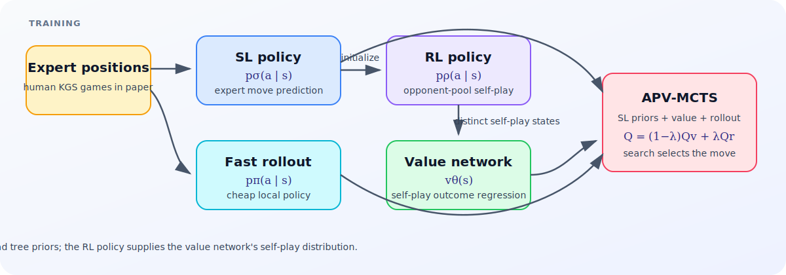

# AlphaGo 2016 with Gymnasium and PyTorch

[](https://github.com/fulcrumai-dev/alphago-gymnasium-pytorch/actions/workflows/ci.yml)
[](https://colab.research.google.com/github/fulcrumai-dev/alphago-gymnasium-pytorch/blob/main/notebooks/alphago_2016_tutorial.ipynb)
[](https://doi.org/10.1038/nature16961)
[](https://www.python.org/)

An educational, scaled reimplementation of Silver et al.'s 2016 paper,
*Mastering the game of Go with deep neural networks and tree search*.

The tutorial follows the paper's complete algorithmic route: supervised policy
learning, a distinct fast rollout policy, opponent-pool REINFORCE, decorrelated
self-play value regression, and policy/value/rollout-guided MCTS. It runs on
Google Colab CUDA, Apple-silicon MPS, or CPU.

> This reproduces the algorithmic pipeline, not DeepMind's distributed compute,
> training corpus, professional strength, Elo, or match results. The exact
> paper-to-code boundary is documented in [the fidelity audit](docs/PAPER_FIDELITY.md).

<p align="center">
  
</p>

## Start with the notebook

Open [`notebooks/alphago_2016_tutorial.ipynb`](notebooks/alphago_2016_tutorial.ipynb)
or use the Colab badge above. In Colab, choose **Runtime → Change runtime type →
T4 GPU**, then run all cells. The default `smoke` profile executes every paper
stage quickly; set `ALPHAGO_PROFILE=tutorial` for larger 5×5 networks and runs.

For a local Apple-silicon environment:

```bash
git clone https://github.com/fulcrumai-dev/alphago-gymnasium-pytorch.git
cd alphago-gymnasium-pytorch
uv sync --frozen --extra dev --python 3.12
uv run jupyter lab notebooks/alphago_2016_tutorial.ipynb
```

Device selection is automatic (`cuda` → `mps` → `cpu`) and explicit requests
fail loudly if unavailable. To execute and validate every notebook cell on MPS:

```bash
uv run python scripts/validate_notebook.py --profile smoke --device mps
```

## What is implemented

- immutable Go positions with capture, suicide, positional superko, pass,
  compact player-relative feature planes, and board-as-is area scoring;
- a checked Gymnasium `reset`/`step` environment with legal-action masks;
- configurable deep policy and value networks plus a shallow rollout network;
- eight-way dihedral data augmentation;
- maximum-likelihood supervised policy training;
- policy-gradient self-play against immutable earlier checkpoints;
- one decorrelated value example per distinct SL → random move → RL game;
- the 2016 APV-MCTS selection formula and separate value/rollout statistics;
- root choice by visit count, with explicit player-perspective backup;
- tutorial board/search plots and two explanatory SVG diagrams.

The match-scale 13-layer/192-filter network, 48/49 full feature stack, KGS and
Tygem corpora, asynchronous 40-thread search, placeholder tree policy, virtual
loss, expansion threshold, and distributed CPU/GPU workers are documented but
deliberately not presented as reproduced.

## Tests and validation

```bash
uv run pytest --cov --cov-branch --cov-report=term-missing --cov-fail-under=80
uv run python scripts/validate_notebook.py --profile smoke --device cpu
```

The test pyramid covers rules, Gymnasium compliance, data generation, network
shapes/gradients/masking, checkpoint immutability, REINFORCE and value targets,
MCTS signs/statistics, plots, references, and the notebook artifact. CI executes
the clean notebook headlessly and retains the result.

For a real managed Google Colab T4—not a local CUDA approximation—install the
official Google CLI and run:

```bash
uv tool install 'google-colab-cli==0.6.0'
scripts/validate_colab_t4.sh
```

The script provisions a fresh T4, executes the notebook, scans every returned
code cell for hidden error outputs, requires the CUDA success sentinel, and
then releases the runtime. Colab allocation still depends on account quota and
capacity.

## Reference paper

The complete citation, DOI, official DeepMind PDF URL, and a checksum-verifying
fetcher are in [`references/`](references/README.md). The copyrighted PDF is
not redistributed; fetch a verified local reading copy directly from the
official object with:

```bash
uv run python references/fetch_paper.py /tmp/AlphaGoNaturePaper.pdf
```

## Repository map

```text
notebooks/                 Educational Jupyter notebook + Jupytext source
src/alphago_gym/go.py      Immutable rules and feature encoding
src/alphago_gym/env.py     Gymnasium adapter
src/alphago_gym/models.py  Policy, rollout, and value networks
src/alphago_gym/training.py
                           SL, REINFORCE, opponent pool, value data/training
src/alphago_gym/mcts.py    Synchronous AlphaGo-style APV-MCTS
tests/                     Unit, integration, artifact, and accelerator tests
docs/PAPER_FIDELITY.md     Paper-exact audit and deviation matrix
references/                Verified paper links and fetcher
scripts/                   Local and managed-Colab notebook validators
```

Code is licensed under the [MIT License](LICENSE). The referenced Nature paper
has its own copyright and reuse terms.

