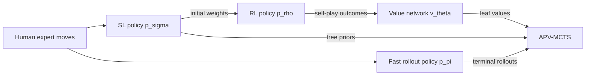

# Paper fidelity and validation boundary

This repository is a **scaled educational reimplementation** of Silver et al.'s
2016 AlphaGo paper. It preserves the paper's four-stage learning pipeline and
policy/value/rollout-guided search, but it does not reproduce DeepMind's data,
distributed system, trained weights, compute budget, or professional playing
strength.

The implementation target is:

> David Silver, Aja Huang, Chris J. Maddison, et al. “Mastering the game of Go
> with deep neural networks and tree search.” *Nature* 529, 484–489 (2016).
> [DOI 10.1038/nature16961](https://doi.org/10.1038/nature16961),
> [official Google DeepMind-hosted PDF](https://storage.googleapis.com/deepmind-media/alphago/AlphaGoNaturePaper.pdf).

The source audit below was last checked against the official paper and current
platform documentation on **2026-07-16**. See
[`references/README.md`](../references/README.md) for a checksum-verified way
to obtain a local reading copy without committing the copyrighted PDF.

## Fidelity labels

| Label | Meaning |
|---|---|
| **Faithful** | The paper's algorithm and information flow are retained. |
| **Scaled** | The same operation is used with smaller exposed dimensions or counts. |
| **Substituted** | A practical teaching replacement has a similar role but is not the paper's method. |
| **Omitted** | The paper component is intentionally absent. |
| **Added** | Engineering for Gymnasium, portability, or teaching that is not in the paper. |

“Faithful” does not mean bit-for-bit reproduction. DeepMind did not publish the
original code, data snapshot, trained parameters, or all systems details needed
for that claim.

## The 2016 AlphaGo algorithm

The most important fidelity requirement is the separation of the four learned
components and their checkpoints:



This routing matters: the search prior is the **supervised policy**
`p_sigma`, not the reinforcement-learned policy `p_rho`. The paper reports that
the SL policy worked better inside AlphaGo because human moves maintained a
diverse beam of promising actions, while RL concentrated on the best action.
The value network, in contrast, approximates the value of the stronger RL
policy. See “Searching with policy and value networks” in the
[paper, pp. 486–487](https://storage.googleapis.com/deepmind-media/alphago/AlphaGoNaturePaper.pdf#page=3).

### Stage 1: supervised and rollout policies

The SL policy `p_sigma(a | s)` is trained by maximum likelihood on expert moves.
The Methods report
[29.4 million positions from 160,000 KGS games](https://storage.googleapis.com/deepmind-media/alphago/AlphaGoNaturePaper.pdf#page=8)
played by 6–9 dan players. The first million positions formed the test set and
the remaining 28.4 million the training set; 35.4% came from handicap games,
pass moves were excluded, and all eight rotations/reflections augmented the
data.

The separate fast rollout policy `p_pi` is a linear softmax over incrementally
computed local response and non-response patterns plus a few handcrafted Go
features. It was trained on 8 million Tygem positions. The paper reports 24.2%
move-prediction accuracy, about 2 microseconds per selected action, and roughly
1,000 rollouts per second per CPU thread on an empty board. It is not a small
copy of the deep policy network; it is a distinct, latency-oriented model. See
the “Rollout policy” Methods section in the
[official PDF, p. 491](https://storage.googleapis.com/deepmind-media/alphago/AlphaGoNaturePaper.pdf#page=8).

### Stage 2: policy-gradient reinforcement learning

The RL policy has the same architecture as the SL policy and begins with
`rho = sigma`. Games are played between the current policy and an opponent
sampled from a pool of earlier checkpoints. The current parameters are added to
that pool every 500 iterations. For a terminal outcome `z_t` from the current
player's perspective, REINFORCE updates the log-probability of each sampled move
toward winning trajectories:

\[
\Delta\rho \propto
  \sum_t \bigl(z_t - b(s_t)\bigr)
  \nabla_\rho \log p_\rho(a_t \mid s_t).
\]

The first pass used a zero baseline; a second pass used the learned value
network as a baseline for a small gain. Training used 10,000 mini-batches of
128 games (1.28 million games), 50 GPUs, and about one day. These details are in
the [policy-RL Methods](https://storage.googleapis.com/deepmind-media/alphago/AlphaGoNaturePaper.pdf#page=8).

### Stage 3: value regression on decorrelated self-play positions

The value network `v_theta(s)` regresses the terminal outcome in `[-1, 1]` for
positions generated from self-play. The paper explicitly avoids taking many
adjacent positions from one game because those samples share a target and led
to severe overfitting.

Its final data-generation recipe produced more than 30 million positions, one
from each distinct game:

1. sample `U` uniformly from 1 through 450;
2. sample moves 1 through `U - 1` from the SL policy;
3. inject one uniformly sampled legal move at `U`;
4. finish the game with the RL policy for both players; and
5. retain only `(s_(U+1), z_(U+1))`.

This is more specific than merely saying “train a value network from
self-play.” The network was trained for 50 million mini-batches of 32 positions
on 50 GPUs for about one week. See the
[value-regression Methods](https://storage.googleapis.com/deepmind-media/alphago/AlphaGoNaturePaper.pdf#page=8).

### Stage 4: asynchronous policy-and-value MCTS

The 2016 search is called asynchronous policy and value MCTS (APV-MCTS). Every
edge stores separate policy, value, and rollout statistics:

\[
\{P(s,a), N_v(s,a), N_r(s,a), W_v(s,a), W_r(s,a), Q(s,a)\}.
\]

During selection it chooses

\[
a_t = \operatorname*{argmax}_a\bigl(Q(s_t,a) + u(s_t,a)\bigr),
\]

using the paper's prior-guided PUCT variant

\[
u(s,a) = c_{\mathrm{puct}} P(s,a)
  \frac{\sqrt{\sum_b N_r(s,b)}}{1 + N_r(s,a)}.
\]

A leaf receives both a value-network estimate and a terminal fast rollout. The
combined edge value is

\[
Q(s,a) = (1-\lambda)\frac{W_v(s,a)}{N_v(s,a)}
       + \lambda\frac{W_r(s,a)}{N_r(s,a)}.
\]

The main text gives the equivalent single-leaf view
`V(s_L) = (1-lambda) v_theta(s_L) + lambda z_L`. Values are always interpreted
from the player-to-move perspective and change sign across alternating plies.

The full system also had several systems-level details:

- a lightweight tree policy supplied temporary priors;
- a node was expanded only after a dynamically controlled visit threshold;
- an asynchronous GPU result later replaced the temporary priors with the SL
  policy at softmax temperature `beta`;
- virtual loss discouraged 40 concurrent search threads from selecting the
  same variation;
- a random dihedral transform provided an implicit eight-way symmetry ensemble;
- CPU rollouts and GPU policy/value evaluations proceeded asynchronously;
- the search tree was reused after a move; and
- the final action was the root action with maximum visit count, not maximum
  `Q`.

The exact search equations and concurrency design appear in the
[Search algorithm Methods](https://storage.googleapis.com/deepmind-media/alphago/AlphaGoNaturePaper.pdf#page=7).
The Fan Hui match parameters were:

| Parameter | Paper value |
|---|---:|
| Policy softmax temperature `beta` | 0.67 |
| Value/rollout mixing `lambda` | 0.5 |
| Virtual loss | 3 |
| Expansion threshold | 40 |
| Exploration constant `c_puct` | 5 |

Source: [Extended Data Table 5](https://storage.googleapis.com/deepmind-media/alphago/AlphaGoNaturePaper.pdf#page=14).

## Paper network inputs and architectures

### Feature planes

All spatial features are relative to the current player. Integer-valued
features are one-hot encoded across planes.

| Feature | Planes | Policy | Value |
|---|---:|:---:|:---:|
| Player stone / opponent stone / empty | 3 | yes | yes |
| Constant ones | 1 | yes | yes |
| Turns since a move was played | 8 | yes | yes |
| Liberties | 8 | yes | yes |
| Capture size | 8 | yes | yes |
| Self-atari size | 8 | yes | yes |
| Liberties after move | 8 | yes | yes |
| Successful ladder capture | 1 | yes | yes |
| Successful ladder escape | 1 | yes | yes |
| Legal and does not fill own eye (“sensibleness”) | 1 | yes | yes |
| Constant zeros | 1 | yes | yes |
| Current player is black | 1 | no | yes |
| **Total** | **48 policy / 49 value** | | |

Source: [Extended Data Table 2](https://storage.googleapis.com/deepmind-media/alphago/AlphaGoNaturePaper.pdf#page=11).

### Networks

| Component | 2016 paper architecture |
|---|---|
| SL/RL policy | 19×19×48 input; 5×5 convolution; hidden layers 2–12 use 3×3 convolutions; ReLU after each hidden convolution; final 1×1 single-filter convolution with a position-specific bias; softmax probability map. The match system used 192 filters per hidden layer. |
| Value | The spatial stack plus the player-colour plane; convolutional trunk, a 1×1 single-filter convolution, a 256-unit fully connected ReLU layer, and one tanh output. |
| Rollout | Linear softmax on local handcrafted pattern/rule features, evaluated incrementally on CPU. |

The paper calls the policy a 13-layer network. It also evaluated 128, 256, and
384 filters, but the match version used 192. The architecture is specified in
the [Neural network architecture Methods](https://storage.googleapis.com/deepmind-media/alphago/AlphaGoNaturePaper.pdf#page=8).

## Reported scale and results

| Item | Paper report |
|---|---:|
| Board | 19×19 Go |
| Match/evaluation rules | Chinese rules, 7.5 komi |
| KGS policy corpus | 29.4M positions from 160,000 games |
| Best reported expert-move test accuracy | 57.0% with all input features |
| SL optimization | 340M training steps with mini-batches of 16; 50 GPUs; about 3 weeks |
| RL optimization | 10,000 mini-batches × 128 games; 50 GPUs; about 1 day |
| Value corpus | More than 30M positions, each from a unique game |
| Value optimization | 50M mini-batches × 32; 50 GPUs; about 1 week |
| Single-machine search | 40 search threads, 48 CPUs, 8 GPUs |
| Distributed search | 40 search threads, 1,202 CPUs, 176 GPUs |
| Program tournament | 494 wins in 495 games (99.8%) against other programs |
| Formal Fan Hui match | 5–0 |

Sources: paper main text and Methods
([training](https://storage.googleapis.com/deepmind-media/alphago/AlphaGoNaturePaper.pdf#page=8),
[search hardware](https://storage.googleapis.com/deepmind-media/alphago/AlphaGoNaturePaper.pdf#page=4),
[results](https://storage.googleapis.com/deepmind-media/alphago/AlphaGoNaturePaper.pdf#page=5),
[evaluation rules](https://storage.googleapis.com/deepmind-media/alphago/AlphaGoNaturePaper.pdf#page=9)).

These numbers are experimental context, not defaults that a Colab tutorial can
reasonably reproduce.

## AlphaGo is not AlphaGo Zero

The 2016 paper already describes its selection rule as a **variant of PUCT**.
It is therefore incorrect to distinguish the systems by saying “AlphaGo used
UCT, while AlphaGo Zero introduced PUCT.” The meaningful differences are the
learned components, data, targets, and leaf evaluation.

| | AlphaGo (target, 2016) | AlphaGo Zero (not the target, 2017) |
|---|---|---|
| Starting data | Human KGS/Tygem games, then self-play | Random initialization and self-play only |
| Networks | Separate SL policy, RL policy, value network, and rollout policy | One residual network with policy and value heads |
| Inputs | 48/49 planes including handcrafted tactical/rule features | Board history/stones without the earlier handcrafted tactical features |
| Tree prior | Frozen SL policy `p_sigma` | Joint network's policy head |
| Leaf evaluation | Mix of value network and terminal rollout | Value head only; no rollout policy |
| Training target | Human moves, REINFORCE outcomes, then value regression | Search visit distribution plus final game outcome |
| Search identity | APV-MCTS with separate rollout/value statistics and asynchronous machinery | Neural MCTS without rollout/value mixing |

Primary contrast sources:

- Silver et al., “Mastering the game of Go without human knowledge,” *Nature*
  550, 354–359 (2017),
  [DOI 10.1038/nature24270](https://doi.org/10.1038/nature24270).
- Google DeepMind's
  [AlphaGo Zero technical announcement](https://deepmind.google/blog/alphago-zero-starting-from-scratch/),
  which explicitly identifies self-play-only learning, the combined network,
  simpler inputs, and removal of rollouts.

## Fidelity matrix for this repository

| Area | 2016 paper | This repository | Label and consequence |
|---|---|---|---|
| Game size | Fixed 19×19 | 3×3 smoke profile, 5×5 tutorial profile; board size configurable | **Scaled.** Exercises captures, passes, scoring, and search cheaply; small-board strategy and distributions are not 19×19 Go. |
| Rules | Chinese rules, 7.5 komi in evaluation; the paper does not publish its automatic dead-stone protocol, and the formal match had a referee | Capture/suicide/positional-superko plus board-as-is Chinese-style area formula and configurable komi; two passes end play without a dead-stone agreement phase | **Faithful core/Substituted adjudication.** Agents must capture dead groups before passing. Unsettled two-pass positions can score differently from referee-adjudicated Chinese play, so paper match scores are not comparable. |
| Environment API | Internal Go engine | Gymnasium environment with spaces, masks, seeding, `reset`, and `step` | **Added.** This is an interoperability layer, not a paper claim. |
| Actions | Board probability map; pass examples excluded from KGS policy data | `size² + 1` actions, including explicit pass | **Added.** Required for a complete reusable environment and terminal two-pass games. |
| Observation | 48 policy planes / 49 value planes | Eight compact rule/history planes | **Substituted.** Retains player-relative spatial state, but omits most one-hot liberty/capture/history planes and ladder search. |
| SL data | 29.4M KGS expert positions | Small synthetic heuristic “expert” games | **Substituted.** Demonstrates imitation learning without redistributing unavailable data; it cannot reproduce expert accuracy. |
| Policy capacity | 13 layers, 192 filters in match system | Configurable shallow PyTorch convolutional network; smoke/tutorial profiles use far fewer layers and channels | **Scaled.** Same spatial policy role, radically lower capacity. |
| SL checkpoint routing | `p_sigma` supplies MCTS priors | A frozen `sl_policy` supplies MCTS priors | **Faithful.** The RL-updated policy is deliberately not substituted as the tree prior. |
| RL policy | Same network initialized from SL; current policy versus random prior checkpoint; REINFORCE | Separate `rl_policy` initialized from SL and trained against a prior-opponent pool | **Faithful/Scaled.** Preserves the opponent-pool policy-gradient stage with tiny exposed counts. |
| Value data | One decorrelated position per unique game; independently sampled SL prefix of U−1 in 0…449, one random move, RL suffix | One position per distinct game; independently sampled SL-prefix length from a profile-scaled range, one random move, RL suffix | **Faithful/Scaled.** Preserves all three phases, per-game prefix variation, and decorrelation with a tiny range/corpus. |
| Value model | Deep convolutional trunk, FC-256, tanh | Small configurable convolutional value network with tanh | **Scaled.** Same target and range, not paper capacity. |
| Fast rollout | Incremental linear softmax over handcrafted local patterns | Shallow learned convolutional/linear rollout approximation | **Substituted.** Preserves a distinct fast stochastic playout policy, not its exact feature engineering or speed. |
| Selection formula | `Q + c P sqrt(sum N_r)/(1+N_r)` | Same prior-guided formula | **Faithful.** This is the 2016 APV-MCTS formula, not evidence that the project targets AlphaGo Zero. |
| Leaf evaluation | Separate value and rollout statistics mixed by `lambda` | Separate value/rollout statistics mixed by exposed `lambda` | **Faithful/Scaled.** Both complementary estimates remain observable. |
| Search execution | Asynchronous, lock-free, CPU/GPU, 40 threads; placeholder priors, threshold 40, virtual loss 3 | Synchronous single-process search | **Omitted systems scale.** No virtual loss, asynchronous batching, placeholder tree policy, or expansion threshold. Search invariants are easier to teach and test. |
| Symmetry | Dataset D8 augmentation; implicit random symmetry ensemble in search | Optional lightweight augmentation where exposed | **Scaled/Omitted.** No claim of the paper's runtime ensemble unless a run explicitly enables it. |
| Training counts | Millions of games/positions and weeks on 50 GPUs | Tiny `smoke` counts and larger but bounded `tutorial` counts, all configurable | **Scaled.** A successful loss decrease validates code paths, not convergence to AlphaGo strength. |
| Optimizer | Asynchronous SGD in the published supervised/value methods | Local Adam in the tutorial | **Substituted.** Objectives, labels, and checkpoint routing are preserved; optimizer dynamics and curves are not paper-replication evidence. |
| Episode cap | Games played to terminal; tournament adjudication details are not published | Final two action slots are forced passes if sampled policies have not terminated; forced actions are excluded from REINFORCE | **Added bounded fallback.** Prevents low-pass toy policies hanging Colab; cap-scored labels are board-as-is and not match-adjudication evidence. |
| Hardware | Large CPU/GPU installations and a distributed version | One CPU, CUDA GPU, or Apple MPS device | **Scaled/Added portability.** Device parity is an engineering goal beyond the paper. |
| Playing-strength claim | Professional-level reported experiments | No professional, dan-rank, 99.8%, or paper-Elo claim | **Not reproduced.** Strength comparisons require the original scale and controlled opponents. |

## What “accurate reimplementation” means here

The repository may claim that it accurately reimplements the **algorithmic
story** only when tests demonstrate all of the following:

- legal Go transitions, terminal rewards, masks, and player perspective;
- SL maximum-likelihood training and a frozen SL tree-prior checkpoint;
- a distinct RL policy initialized from SL and trained with self-play outcomes;
- one-position-per-game value targets from broadened self-play trajectories;
- a distinct fast rollout policy;
- the exact prior-guided selection term shown above;
- separate value and rollout estimates mixed by `lambda`;
- alternating-player sign handling during backup; and
- maximum-visit root action selection.

It must **not** claim scientific replication of the paper's strength, training
curves, expert-move accuracy, Elo, or match results. Smoke runs prove software
execution and invariants; they do not prove convergence.

## Google Colab and CLI validation

### Official consumer Colab CLI

Google now publishes the Apache-2.0
[`googlecolab/google-colab-cli`](https://github.com/googlecolab/google-colab-cli)
and the verified PyPI package
[`google-colab-cli`](https://pypi.org/project/google-colab-cli/). Version 0.6.0,
released 2026-06-16, can allocate managed Colab CPU/GPU/TPU sessions and execute
ordinary `.ipynb` files from a terminal. This is the appropriate CLI for a real
hosted-Colab T4 validation; it is not a local container pretending to be Colab.

Install it in an isolated tool environment, authenticate the Colab account, and
run the notebook on a fresh T4 session:

```bash
uv tool install 'google-colab-cli==0.6.0'
SESSION=alphago-validation
colab new --session "$SESSION" --gpu T4
trap 'colab stop --session "$SESSION"' EXIT
colab status --session "$SESSION"
colab exec \
  --session "$SESSION" \
  --file notebooks/alphago_2016_tutorial.ipynb \
  --timeout 1800
```

The official CLI's
[v0.6.0 notebook executor](https://github.com/googlecolab/google-colab-cli/blob/v0.6.0/src/colab_cli/commands/execution.py)
writes an executed sibling named
`notebooks/alphago_2016_tutorial_output.ipynb`. A
rigorous validation must retain or summarize four pieces of evidence:

1. `colab version` and the exact command;
2. `colab status` showing the requested managed accelerator, without publishing
   session tokens;
3. notebook output showing `torch.cuda.is_available() is True` and the actual
   CUDA device name; and
4. a machine check that **no code cell has an `error` output**, plus the final
   notebook success sentinel.

Do not rely only on shell exit status. In the 0.6.0 implementation, notebook
cells are executed sequentially and errors are captured as Jupyter outputs; the
executed notebook itself is the authoritative error record. Increase
`--timeout` from its 30-second default because it applies to code execution and
training/install cells can be silent for longer.

Accelerator availability still depends on the user's Colab subscription tier,
quota, and current capacity. The official
[Colab FAQ](https://research.google.com/colaboratory/faq.html) says resources
are not guaranteed and can fluctuate.

### Open the published notebook interactively

Colab's FAQ confirms that notebooks can be loaded from GitHub. The official
[Open in Colab extension](https://github.com/googlecolab/open_in_colab)
documents the direct URL mapping:

```text
https://colab.research.google.com/github/OWNER/REPOSITORY/blob/REF/PATH.ipynb
```

After opening it, choose **Runtime → Change runtime type → GPU**, then run all
cells. A repository badge should use the same URL. The notebook must install or
clone every nonstandard dependency because, as the FAQ notes, the VM and custom
files are not shared with the notebook.

### Other official Colab execution products

These are valid but answer different questions:

- [`googlecolab/colab-mcp`](https://github.com/googlecolab/colab-mcp) bridges a
  local agent client to an authenticated notebook in a browser. It is useful for
  interactive editing, not the preferred deterministic batch validation here.
- [`gcloud colab executions create`](https://docs.cloud.google.com/sdk/gcloud/reference/colab/executions/create)
  runs Colab **Enterprise** notebooks from local IPYNB content or Cloud Storage.
  It requires a billed Google Cloud project, IAM identity, output bucket, and a
  Colab Enterprise runtime template; it is not the consumer Colab CLI above.
- [Colab local runtimes](https://research.google.com/colaboratory/local-runtimes.html)
  connect the Colab front end to user-controlled Jupyter or Docker compute.
  They are useful compatibility checks, but do not validate a hosted Colab GPU.

### Apple GPU validation

PyTorch's official
[MPS backend documentation](https://docs.pytorch.org/docs/stable/notes/mps)
uses the `mps` device for Apple Metal GPU execution. A local Mac validation is
complete only if the notebook or smoke runner reports
`torch.backends.mps.is_available() is True`, moves the models and tensors to
`mps`, completes forward/backward/optimizer steps there, and passes the
accelerator smoke tests. CPU fallback is useful, but it is not evidence of an
Apple GPU run.

## Source hierarchy

Algorithm claims in this document use the 2016 Nature paper and its Methods and
Extended Data. The 2017 Nature record and DeepMind announcement are used only
for the AlphaGo Zero contrast. Runtime claims use Google Colab, Google Cloud,
PyTorch, or Apple documentation and official GoogleColab repositories. No
third-party AlphaGo tutorial is treated as evidence for paper fidelity.
